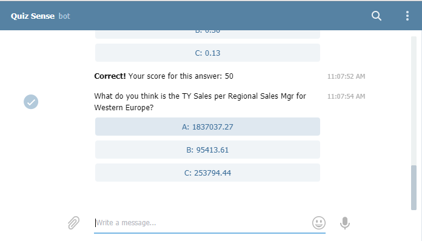
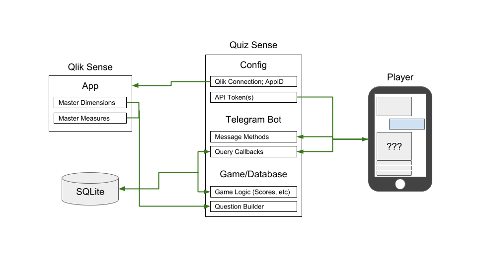

# Quiz Sense

Quiz Sense is essentially a ChatBot that connects to your Qlik Sense Server, pulls master dimensions and measures from an app to generate quiz questions like these:



The project consinsts of 3 backend components that handle communication to Qlik Sense, the telegram interface and a database to keep track of questions and scores.



The entire code is written in typescript and runs on node.js. To run your own copy do the following:

You'll need a telegram bot (token) see here, if you don't know how to get one: https://core.telegram.org/bots#3-how-do-i-create-a-bot

Then:

1) Download the repo

2) Extract and `run npm install` from inside the main directory (where package.json is)

3) Enter the configuration for your telegram bot and Qlik Sense connection in `./src/config/config.ts`

```javascript
// ./src/config/config.ts

// Telegram stuff
export var botToken: string = '<YOUR TELEGRAM API TOKEN>';

// Environment stuff
export var proxy: string = '<YOUR HTTP PROXY ADDRESS | null if unapplicable>';

// Qlik Sense Stuff
export var qlikCertificateDir: string = './src/cert/';
export var qlikUser: string     = 'UserDirectory= INTERNAL;UserId= SA_API';
export var qlikServer: string   = '<YOUR QS SERVER WSS URL | ws://localhost:9076/app/engineData for QS Desktop>';
export var qlikApp: string      = '<THE APP ID YOU WANT TO CONNECT TO>';
```

4) Export Qlik Sense certificates to facilitate communication between the backend and the engine (https://help.qlik.com/en-US/sense/February2019/Subsystems/ManagementConsole/Content/Sense_QMC/export-certificates.htm)

5) Run `tsc` in the main directory to compile your code.

6) Run `node ./dist/app.js`

7) Start Telegram and talk to your quiz master

Happy Quizing!!

Refer to https://alcmst.net/2019/03/01/quiz-sense-who-wants-to-be-a-qlikionnaire/ for more information
